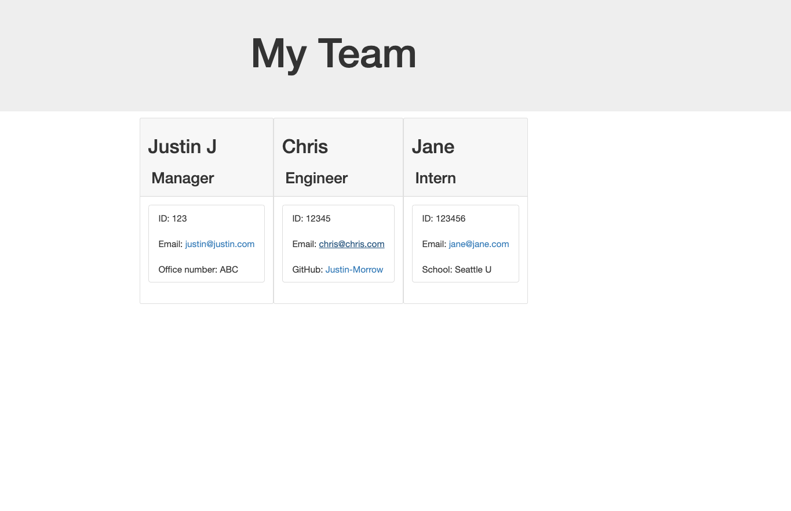

# Password-Generator
(https://justin-morrow.github.io/Password-Generator/)
## Table of Contents

- [Description](#Description)

- [Installation](#Installation)

- [Instructions](#Instructions)

- [License](#License)

- [Contribute](#Contribute)

- [Tests](#Tests)

- [Questions](#Questions)

## Description

According to Wikipedia "A web API is an application programming interface for either a web server or a web browser. It is a web development concept, usually limited to a web application's client-side (including any web frameworks being used), and thus usually does not include web server or browser implementation details such as SAPIs or APIs unless publicly accessible by a remote web application.

A server-side web API is a programmatic interface consisting of one or more publicly exposed endpoints to a defined request–response message system, typically expressed in JSON or XML, which is exposed via the web—most commonly by means of an HTTP-based web server."

The Profile-Generator project is an assignment that asks for the web developer to build a Node.js command-line application that takes in information about employees on a software engineering team, then generates an HTML webpage that displays summaries for each person. Testing is key to making code maintainable, so a unit test is written for every part the code to ensure that it passes each test.

Because this application isn't deployed, a walkthrough video that demonstrates its functionality and all of the tests passing will be required. 

## Installation

The program requires a basic opearting system such as windows or iOS needs a web browswer. 

## Instructions

The quiz begins by using two items on the integrated terminal. First use "npm run test" to confirm the code passes all of the tests. Then, run "node index.js" in the integrated terminal. At that point, the user enters all of the data for their team under the roles of Manager, Engineer and Intern. Once the team profile is completed, the user will end the command and an HTML page will generate the team profile for visibility.  

## License

This application is covered under the GNU GPLv3.0 License.

## Contribute

Justin Morrow

## Tests

No Tests.

## Questions

If you have questions, please contact me at the information below:

GitHub: [Justin Morrow](https://github.com/Justin-Morrow)
